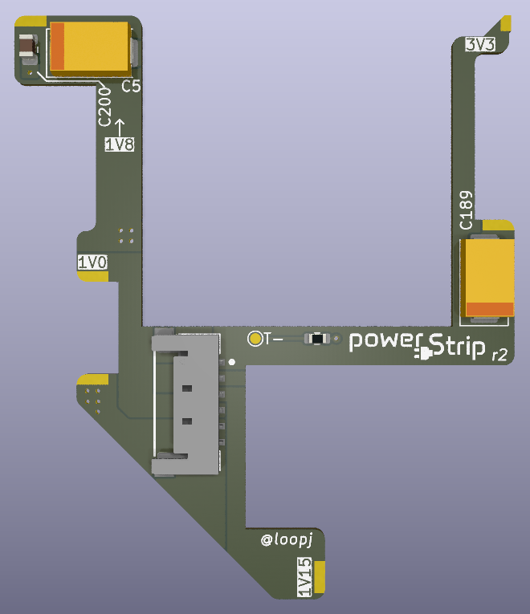

  
  

<h3 align="center">Slimline PCB to supply power to trimmed Wii motherboards</h3>

  

## Features

- Solders directly onto the top of a Wii motherboard
- Supplies power to the 1V, 1.15V, 1.8V, and 3.3V points
- Power connector allows for modular builds without soldering/desoldering wires
- Adds pads for the relocation of capacitors (C5, C189, C200) typically removed on more aggressive trims
- Pad for an optional thermistor, for compatibility with [4Layer Technologies RVL-PMS](https://4layertech.com/products/rvl-pms-2)
- Fits entirely within the outline of an Omega trim
- Fits under heatplates/heatsinks

## Parts / Ordering

- Grab the Gerber files for the [latest release](https://github.com/loopj/wii-power-strip/releases/latest)
- Order a 2-layer, 0.6mm PCB from JLCPCB or similar fab
- Purchase a 6-pin Molex Pico-Lock connector, PN 504050-0691 ([DigiKey](https://www.digikey.com/en/products/detail/molex/5040500691/4357148), [Mouser](https://www.mouser.com/ProductDetail/Molex/504050-0691?qs=bvCPb%252BE7ys2K1LQC9e%2FvRg%3D%3D))
- Purchase either a pre-assembled cable, or parts to crimp your own
  - 50mm pre-assembled cable, PN 15132-0600 ([DigiKey](https://www.digikey.com/en/products/detail/molex/0151320600/7423256), [Mouser](https://www.mouser.com/ProductDetail/Molex/15132-0600?qs=HXFqYaX1Q2wQ%2F2lUgfK5Kw%3D%3D))
  - 100mm pre-assembled cable, PN 15132-0601 ([DigiKey](https://www.digikey.com/en/products/detail/molex/0151320601/7423257), [Mouser](https://www.mouser.com/ProductDetail/Molex/15132-0601?qs=HXFqYaX1Q2xvCBLpk4R9sg%3D%3D))
  - Connector, PN 504051-0601 ([DigiKey](https://www.digikey.com/en/products/detail/molex/5040510601/4357150), [Mouser](https://www.mouser.com/ProductDetail/Molex/504051-0601?qs=bvCPb%252BE7ys2KoBFgs2%2FzNw%3D%3D))
  - Crimp terminals, PN 504052-0098 ([DigiKey](https://www.digikey.com/en/products/detail/molex/5040520098/4357152), [Mouser](https://www.mouser.com/ProductDetail/Molex/504052-0098-Cut-Strip?qs=lzT3SgJKZn3tXLBIQ9V4FQ%3D%3D))
- Optional - 10KΩ thermistor with a 3380K B value, in an 0603 SMD package

## Installation

- If you are doing a motherboard trim that will trim off C5 or C189, desolder these and save them
- If you are doing a NAND relocation which removes C200, desolder this and save it
- Solder the connector and any rescued capacitors to the board by hand or using a hot plate
- Place board on the Wii motherboard, it should self-align
- Solder the pads on the edge of the board to the Wii motherboard
  - 1V0 to the top of C143
  - 1V15 to the left of C17
  - 1V8 to the via array at the top left. You may wish to scratch away some solder mask to have more copper to solder to.
  - 3V3 to the top of C128
  - GND to the bottom of C180 and C143
- Use plenty of solder and flux!

## C189 height

Some motherboard revisions have a very tall (~2.9mm) C189 capacitor, which can interfere with heatplates if you are relocating it. If you have one of these boards, you may wish to consider purchasing a lower profile capacitor. As long as it is a 220uF, 6.3V+, 2917 or 2312 SMD package capacitor it should work fine. The Kyocera AVX NOJY227M006RWJ is a low profile version of the original cap used on the Wii. The TAJX227K006RNJ or TAJY227K006RNJ should also both work.

## RVL-PMS Companion Board

If you want to use Power Strip with the 4Layer Technologies [RVL-PMS-2](https://4layertech.com/products/rvl-pms-2), or [RVL-PMS-Lite](https://4layertech.com/products/pms2-lite) boards, Y2K has designed a carrier board called the *Power Strip PMS Companion*.

The PMS Companion is included in this repository for convenience, you can read more about it in the [pms-companion](pms-companion) directory.

## License

Permissively released under the Solderpad Hardware License v2.1
