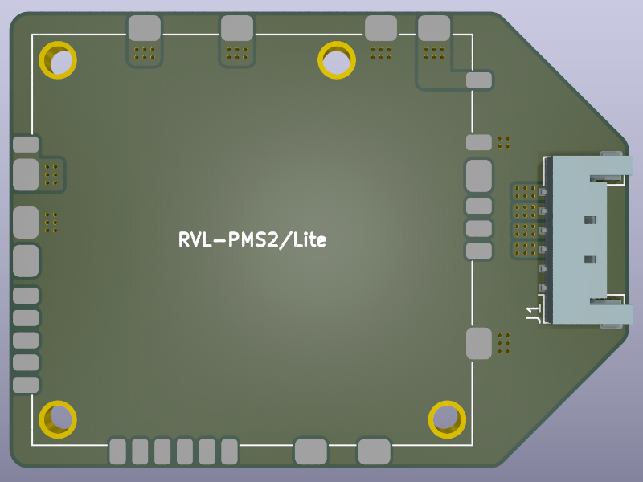

# Power Strip PMS Companion

A carrier board for the 4Layer Technologies [RVL-PMS-2](https://4layertech.com/products/rvl-pms-2), or [RVL-PMS-Lite](https://4layertech.com/products/pms2-lite) boards which adds a pico-lock connector for the Wii Power Strip. Designed by [Y2K](https://github.com/y2k-x).

## Parts / Ordering

- Grab the Gerber files from the [latest release](https://github.com/loopj/wii-power-strip/releases/latest)
- Order a 2-layer PCB from JLCPCB or similar fab, of desired thickness
- Order a [RVL-PMS-2](https://4layertech.com/products/rvl-pms-2) or [RVL-PMS-Lite](https://4layertech.com/products/pms2-lite)
- Purchase a 6-pin Molex Pico-Lock connector, PN 504050-0691 ([DigiKey](https://www.digikey.com/en/products/detail/molex/5040500691/4357148), [Mouser](https://www.mouser.com/ProductDetail/Molex/504050-0691?qs=bvCPb%252BE7ys2K1LQC9e%2FvRg%3D%3D))
